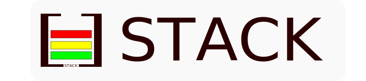

  

| [russian](./README.md#Список-алгоритмов-[russian]) 
|

### Список алгоритмов [russian]
| [Алгебра](./README.md#Алгебра) 
| [Сортировки](./README.md#Сортировки) 
| [Графы](./README.md#Графы) 
| [Строки](./README.md#Строки)
| [Структуры данных](./README.md#Структуры-данных)
| [Алгоритмы на последовательностях](./README.md#Алгоритмы-на-последовательностях)
|

#### Алгебра
* [Вычисление n-числа Фибоначчи](./notes/ru/algebra/fibonacci.md)
* [Разложение на множители (факторизация)](./notes/ru/algebra/factorization.md)
* [Генерация правильных скобочных последовательностей](./notes/ru/algebra/gen_bracket_seq.md)

#### Сортировки
* [Сортировка подсчетом](./notes/ru/sorting/counting.md)
* [Быстрая сортировка](./notes/ru/sorting/quick_sort.md)
* [Сортировка слиянием](./notes/ru/sorting/merge_sort.md)

#### Графы
* [Обход графа в глубину](./notes/ru/graph/depth.md)
* [Обход графа в ширину](./notes/ru/graph/breadth.md)

#### Строки
* [Проверка слова на палиндром](./notes/ru/string/is_palindrome.md)

#### Структуры данных
* [Стек](./notes/ru/structure/stack.md)
* [Система непересекающихся множеств](./notes/ru/structure/union_find.md)
* [Дерево отрезков](./notes/ru/structure/segment_tree.md)
* [Префиксный массив сумм](./notes/ru/structure/prefix_sum_array.md)

#### Алгоритмы на последовательностях
* [Поиск подмассива с максимальной суммой. Алгоритм Джея Кадане](./notes/ru/sequentia/maximum_subarray_problem.md)
* [Поиск подмассива с минимальной суммой. Алгоритм Джея Кадане](./notes/ru/sequentia/minimun_subarray_problem.md)
* [Поиск k-ой порядковой статистики](./notes/ru/sequentia/find_order_statistic.md)
* [Расстояние Левенштейна](./notes/ru/sequentia/levenshtein_distance.md)
